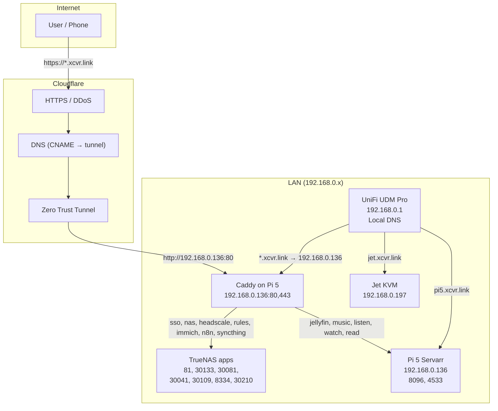

# Caddy / Local DNS / Ports / Cloudflare Tunnel — Diagram & Verification

**Purpose:** Single diagram and verification of Caddy on Pi 5, local DNS (UniFi), port assignments, Cloudflare Tunnel routes, and DNS records for `xcvr.link`. (NPM+ has been replaced by Caddy on Pi 5.)

**Last verified:** 2026-02-10 (pre-migration; update after cutover)

---

## 1. Architecture Diagram



**Flow summary**

- **External:** `https://subdomain.xcvr.link` → Cloudflare → Tunnel → `http://192.168.0.136:80` → Caddy on Pi 5 → backend by hostname.
- **LAN:** Client uses UDM Pro DNS (192.168.0.1) → Local DNS resolves proxied `*.xcvr.link` to 192.168.0.136 → browser hits Caddy on 80/443; pi5/jet resolve to their IPs.

---

## 2. Port Assignments

### Caddy (Pi 5, 192.168.0.136)

| Purpose | Port | Note |
|---------|------|------|
| HTTP    | 80   | Proxy (tunnel + LAN) |
| HTTPS   | 443  | Proxy (Let's Encrypt) |

Caddyfile: `scripts/servarr-pi5/caddy/Caddyfile` in dotfiles; deployed to `/var/lib/caddy/config/Caddyfile` on the Pi.

### TrueNAS host (192.168.0.158) — backends for Caddy

| Service      | Port   | Caddy hostname      |
|-------------|--------|----------------------|
| TrueNAS UI  | 81     | nas.xcvr.link        |
| Authelia    | 30133  | sso.xcvr.link        |
| Headscale   | 30210  | headscale.xcvr.link  |
| rules-static| 30081  | rules.xcvr.link      |
| Immich      | 30041  | immich.xcvr.link     |
| n8n         | 30109  | n8n.xcvr.link        |
| Syncthing   | 8334   | syncthing.xcvr.link  |

### Pi 5 (192.168.0.136) — backends for Caddy

| Service   | Port | Caddy hostname        |
|----------|------|------------------------|
| Jellyfin | 8096 | jellyfin, listen, watch, read.xcvr.link |
| Navidrome| 4533 | music.xcvr.link        |

### Other (no proxy)

| Host  | IP             | Note           |
|-------|----------------|----------------|
| pi5   | 192.168.0.136  | Direct; no proxy |
| jet   | 192.168.0.197  | Jet KVM; no proxy |

---

## 3. Caddy Proxy Hosts (Caddyfile server blocks)

Defined in `scripts/servarr-pi5/caddy/Caddyfile`. Verify with `./scripts/caddy/verify-caddy-hosts.sh`.

| Domain             | Forwards To           |
|--------------------|------------------------|
| sso.xcvr.link      | 192.168.0.158:30133   |
| nas.xcvr.link      | 192.168.0.158:81      |
| headscale.xcvr.link| 192.168.0.158:30210   |
| rules.xcvr.link    | 192.168.0.158:30081   |
| immich.xcvr.link   | 192.168.0.158:30041   |
| n8n.xcvr.link      | 192.168.0.158:30109   |
| syncthing.xcvr.link| 192.168.0.158:8334    |
| jellyfin.xcvr.link | 192.168.0.136:8096    |
| music.xcvr.link    | 192.168.0.136:4533    |
| listen, watch, read.xcvr.link | 192.168.0.136:8096 |

---

## 3b. Fixes for known issues

| Issue | Fix |
|-------|-----|
| **music.xcvr.link** (or any host) no local DNS | Re-run `./unifi/add-local-dns-via-ssh.sh`. The script points all proxied hostnames (sso, nas, headscale, rules, immich, n8n, syncthing, jellyfin, music, listen, watch, read) to **192.168.0.136**. Add manually in UniFi → Networks → [LAN] → DHCP → Local DNS if needed: e.g. `music` / `xcvr.link` / `192.168.0.136`. |
| **sso.xcvr.link** 502 through Caddy | Caddy on Pi 5 cannot reach Authelia on TrueNAS (192.168.0.158:30133). See **`sso-authelia-502-deep-dive.md`**. Ensure Pi 5 can reach 192.168.0.158; check Caddy logs. |

---

## 4. Local DNS (UniFi)

**Where:** UniFi → Settings → Networks → [LAN] → DHCP → Local DNS Records.

**Expected (hostname | domain | IP):** All proxied hosts point to Caddy on Pi 5 (192.168.0.136).

| Hostname | Domain   | IP Address     |
|----------|----------|----------------|
| sso      | xcvr.link| 192.168.0.136  |
| nas      | xcvr.link| 192.168.0.136  |
| headscale| xcvr.link| 192.168.0.136  |
| rules    | xcvr.link| 192.168.0.136  |
| immich   | xcvr.link| 192.168.0.136  |
| n8n      | xcvr.link| 192.168.0.136  |
| syncthing| xcvr.link| 192.168.0.136  |
| pi5      | xcvr.link| 192.168.0.136  |
| jellyfin | xcvr.link| 192.168.0.136  |
| music    | xcvr.link| 192.168.0.136  |
| listen   | xcvr.link| 192.168.0.136  |
| watch    | xcvr.link| 192.168.0.136  |
| read     | xcvr.link| 192.168.0.136  |
| jet      | xcvr.link| 192.168.0.197  |

**Fix:** Re-run `./unifi/add-local-dns-via-ssh.sh` to push all records (script is updated for 192.168.0.136).

---

## 5. Cloudflare Tunnel — Published Routes

**Where:** Cloudflare Dashboard → Zero Trust → Networks → Tunnels → [tunnel] → Public Hostnames.

All proxied hostnames should point at Caddy on Pi 5 (single entry point):

| Subdomain | Domain   | Service URL                |
|-----------|----------|----------------------------|
| sso       | xcvr.link| http://192.168.0.136:80    |
| nas       | xcvr.link| http://192.168.0.136:80    |
| headscale | xcvr.link| http://192.168.0.136:80    |
| rules     | xcvr.link| http://192.168.0.136:80    |
| immich    | xcvr.link| http://192.168.0.136:80    |
| n8n       | xcvr.link| http://192.168.0.136:80    |
| syncthing | xcvr.link| http://192.168.0.136:80    |
| jellyfin  | xcvr.link| http://192.168.0.136:80    |
| music     | xcvr.link| http://192.168.0.136:80    |
| politics  | xcvr.link| http://192.168.0.136:80    |

Optionally add listen, watch, read with Service URL `http://192.168.0.136:80`. Do **not** add tunnel routes for `pi5` or `jet` (local-only unless you expose them separately).

---

## 6. Cloudflare DNS Records (Public)

**Where:** Cloudflare Dashboard → DNS → Records.

Tunnel hostnames are usually CNAME to your tunnel (e.g. `xxx.cfargotunnel.com`), Proxied. Verify one record per subdomain above; pi5/jet can be omitted or A to home IP if needed.

| Type  | Name   | Content (example)        | Proxy   |
|-------|--------|--------------------------|---------|
| CNAME | sso    | &lt;tunnel&gt;.cfargotunnel.com | Proxied |
| CNAME | nas    | …                        | Proxied |
| …     | …      | …                        | …       |

---

## 7. Verification Commands

Run from Mac on LAN (DNS = 192.168.0.1).

### Local DNS

```bash
for h in sso nas headscale rules immich n8n syncthing pi5 jellyfin music listen watch read jet; do
  r=$(dig +short $h.xcvr.link 2>/dev/null | head -1)
  echo "$h.xcvr.link → ${r:-no result}"
done
```

### Caddy proxy hosts (per-host check)

```bash
./scripts/caddy/verify-caddy-hosts.sh
```

### External (off-Wi‑Fi)

```bash
curl -sI -m 5 https://immich.xcvr.link | head -5
curl -sI -m 5 https://sso.xcvr.link | head -5
```

---

## 8. Verification Summary

| Layer        | Check |
|--------------|--------|
| Caddy on Pi 5 | `curl -sI -H "Host: immich.xcvr.link" http://192.168.0.136` or `./scripts/caddy/verify-caddy-hosts.sh` |
| Local DNS    | All proxied hosts → 192.168.0.136; run `./unifi/add-local-dns-via-ssh.sh` if needed |
| Tunnel / CF DNS | Service URL for each hostname = `http://192.168.0.136:80`; verify in Cloudflare dashboard |

---

## 9. Related Docs

- **Migration:** `caddy-pi5-replace-npm.md`
- **Alignment table:** `dns-alignment-unifi-cloudflare-npm.md`
- **Tunnel + Caddy:** `cloudflare-tunnel-direct-routes.md`
- **TrueNAS ports:** `truenas-app-service-urls.md`
