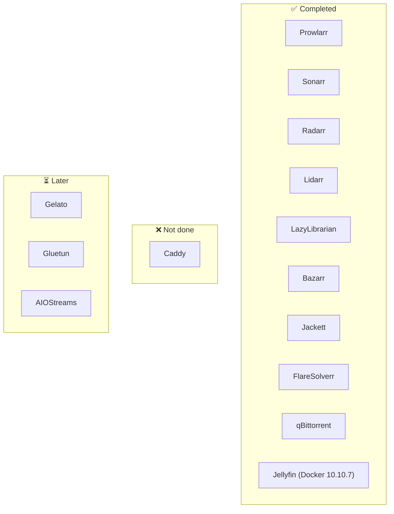
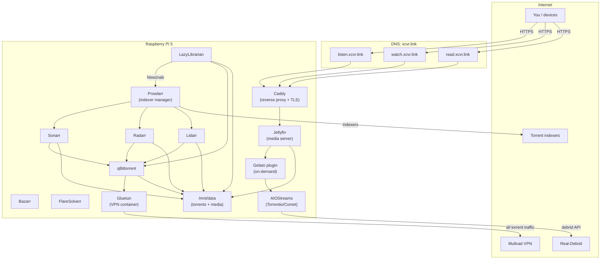
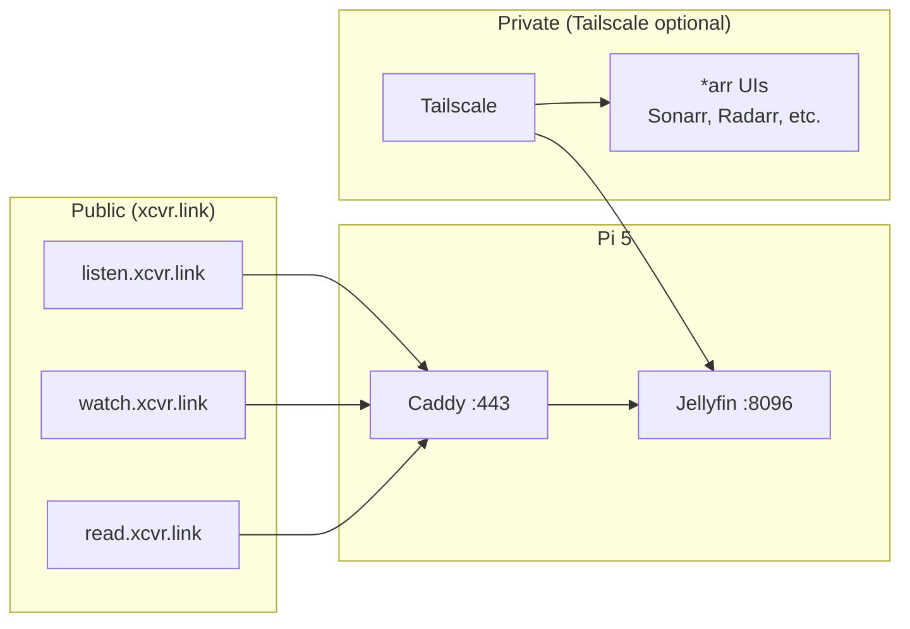
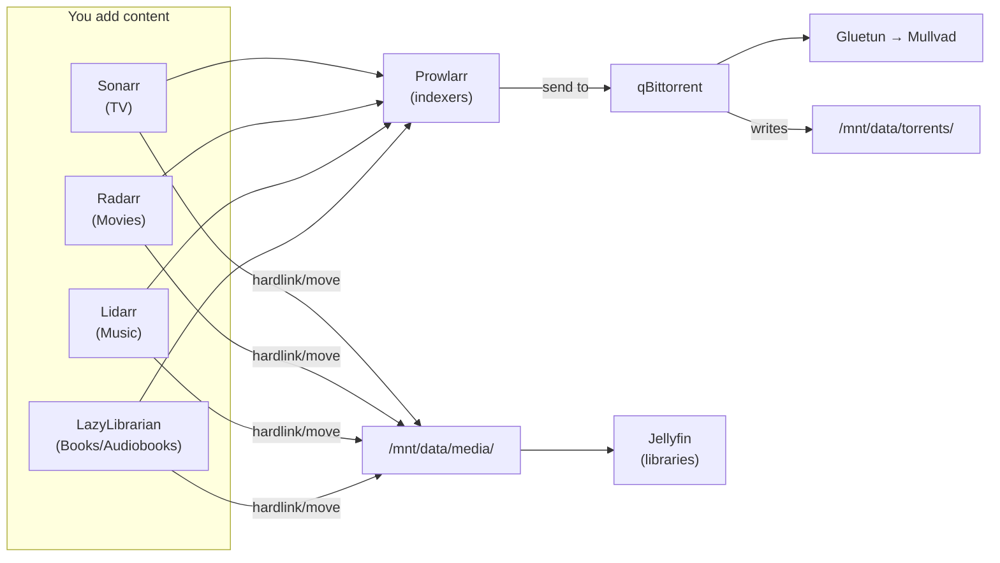
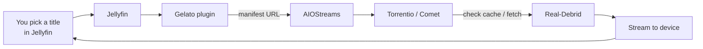

# Servarr Pi 5: System Architecture (Visual)

**Domain:** xcvr.link (listen / watch / read)  
**Hardware:** Pi 5 8GB, Samsung 990 EVO Plus 1TB NVMe

---

## 0. Completion Status (as of 2026-02-02)

| Component | Status | Notes |
|-----------|--------|-------|
| **Prowlarr** | ✅ Running | Port 9696 |
| **Sonarr** | ✅ Running | Port 8989 |
| **Radarr** | ✅ Running | Port 7878 |
| **Lidarr** | ✅ Running | Port 8686 |
| **LazyLibrarian** | ✅ Running | Port 5299 |
| **Bazarr** | ✅ Running | Port 6767 |
| **Jackett** | ✅ Running | Port 9117 |
| **FlareSolverr** | ✅ Running | Port 8191 |
| **qBittorrent** | ✅ Running | Port 8080 |
| **Jellyfin** | ✅ Running | Docker 10.10.7 on port 8096 |
| **Caddy** | ❌ Not installed | Reverse proxy for listen/watch/read.xcvr.link |
| **Gelato** | ⏳ Pending | Jellyfin plugin for on-demand |
| **Gluetun** | ⏳ Pending | VPN for qBittorrent (optional) |
| **AIOStreams** | ⏳ Pending | Torrentio/Comet for Gelato |

---

## 1. High-level: What runs where

---

## 2. Remote access paths

- **Public:** listen / watch / read → Caddy → Jellyfin (Let’s Encrypt).
- **Private:** Tailscale (optional) for *arr admin and Jellyfin without exposing ports.

---

## 3. Download → library flow (permanent media)

Same filesystem (`/mnt/data`) so *arr can hardlink from `torrents/` to `media/` (no copy). Jellyfin scans `media/`.

---

## 4. On-demand flow (Gelato + AIOStreams)

No download to disk; stream via Real-Debrid. Gelato libraries (e.g. `/tmp/gelato/movies`, `series`) are populated by the plugin from AIOStreams.

---

## 5. Component summary

| Component | Role | Talks to |
|-----------|------|----------|
| **Caddy** | Reverse proxy, TLS (listen/watch/read.xcvr.link) | Jellyfin :8096 |
| **Jellyfin** | Media server, users, libraries | Storage, Gelato |
| **Gelato** | Jellyfin plugin: on-demand sources | AIOStreams (manifest URL) |
| **AIOStreams** | Aggregates Torrentio/Comet addons | Real-Debrid |
| **Prowlarr** | Indexer manager | Sonarr, Radarr, Lidarr, indexers; LazyLibrarian adds Prowlarr as Newznab |
| **Sonarr / Radarr / Lidarr / LazyLibrarian** | Automate TV / movies / music / books & audiobooks | Prowlarr, qBittorrent, storage |
| **Bazarr** | Subtitles | Sonarr, Radarr |
| **FlareSolverr** | Bypass Cloudflare on indexers | Prowlarr / indexers |
| **qBittorrent** | Torrent client | Gluetun (network), storage |
| **Gluetun** | VPN (Mullvad); only qBittorrent uses it | Mullvad, qBittorrent |
| **Storage** | `/mnt/data` (torrents + media) | All *arr, qBittorrent, Jellyfin |

---

## 6. SSO options for exposed subdomains (xcvr.link)

Right now **listen**, **watch**, and **read** all hit the **same** Jellyfin instance, so one Jellyfin login covers all three. If you add more apps (e.g. Calibre-Web, FreshRSS) or expose *arr UIs and want **one login for everything**, see the **feature matrix:** **`sso-feature-matrix.md`** (same folder) — what self-hosters use, full comparison table, and Pi 5 recommendation. Short summary:

| Option | What it does | Pros | Cons |
|--------|----------------|------|------|
| **No SSO (current)** | Each app has its own login. Jellyfin = one login for listen/watch/read. | Simple, nothing extra to run. | Separate logins per app if you expose more. |
| **Authelia + Caddy forward_auth** | One login at e.g. **sso.xcvr.link**. Caddy sends unauthenticated requests to Authelia; after login, session cookie grants access to all protected subdomains. | Lightweight (~30 MB RAM), 2FA, file or LDAP users, works well on Pi. Official Caddy integration. | You run and configure Authelia (Docker). Jellyfin has its own users—use Authelia in front and optionally **Jellyfin SSO plugin** with Authelia as OIDC so one Authelia account = Jellyfin login. |
| **Authentik** | Full IdP (OIDC/OAuth2, SAML). Jellyfin SSO plugin can use Authentik. | Rich features, nice UI, one place for all app logins. | Heavier than Authelia; may be tight on Pi 5 with full stack. |
| **oauth2-proxy + Caddy** | Caddy forward_auth to oauth2-proxy; login with Google/GitHub or any OIDC provider. | Simple “login with Google” in front of everything. | No built-in user DB; depends on external IdP. Less control than self-hosted Authelia/Authentik. |
| **Tailscale (no public login)** | Don’t expose Jellyfin/*arr on the internet; use Tailscale to reach them. | No public login page; Tailscale identity is your “SSO.” | Services only reachable when on Tailscale; not true SSO for random subdomains. |

**Recommended for Pi 5:** **Authelia** behind Caddy (forward_auth). Put Authelia at e.g. **sso.xcvr.link**; protect listen/watch/read (and any other apps) with Caddy’s `forward_auth` to Authelia. For Jellyfin specifically, either (a) rely on Authelia in front (login to Authelia, then Caddy passes you to Jellyfin—Jellyfin can be set to trust the proxy and use Authelia’s `Remote-User` header if supported), or (b) use the **Jellyfin SSO plugin** with Authelia as OIDC so Jellyfin login is “Sign in with Authelia.”
